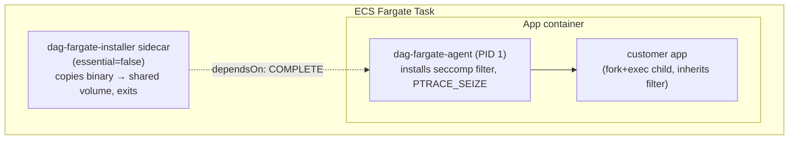

## Why this exists

Fargate forbids privileged containers, `CAP_SYS_ADMIN`/`CAP_BPF`, and custom BTF — eBPF is impossible there. None of `agent/kernel/**` runs on Fargate. The rest of the endpoint fleet (K8s DaemonSet, EC2/systemd, ECS-on-EC2) keeps using the eBPF agent unchanged; Fargate gets a **separate binary, image, and release** (`dag-fargate-agent`) that ships the identical event wire format.

Full design doc (source of truth, includes the phased implementation plan): [`data-access-governance/docs/fargate-agent-plan.md`](https://github.com/hilt-ai/data-access-governance/blob/main/docs/fargate-agent-plan.md). Customer-facing version: [`data-access-governance/docs/fargate-agent.md`](https://github.com/hilt-ai/data-access-governance/blob/main/docs/fargate-agent.md).

## Architecture: entrypoint-wrapper, not a passive sidecar

The only capability Fargate lets you add is `CAP_SYS_PTRACE`. Getting file-event parity out of that requires **seccomp-assisted ptrace** (the same model Sysdig's `pdig` uses): a seccomp-BPF filter traps only the ~20 DAG-relevant syscalls into the tracer; everything else (`read`/`write`/`futex`/`epoll_wait`) runs at native speed.

The catch: a seccomp filter can only be installed by a process **on itself**, before it drops privileges, and is then inherited by its children. You cannot inject a filter into an already-running foreign process. So the agent must be the **parent** of the application:

This rules out a passive watcher sidecar (separate container polling `/proc`) — it can only do naive "trap every syscall" (too slow) or lose file events entirely. We are not doing that model.

To keep this invisible to the customer (no image rebuild), the installer sidecar copies the binary into a task-scoped shared volume (`/dag`) and the injection tooling (below) rewrites the app container's entrypoint to `["/dag/dag-fargate-agent", "--", <original command>]`.

## Collection engines

| Engine | File | Runs when | Captures |
| :-- | :-- | :-- | :-- |
| `engine_ptrace` | `agent/fargate/engine_ptrace.c` + `seccomp_filter.c` | `DAG_FARGATE_MODE=full` (default) | Exec, file open/unlink/rename/chmod, net connect/accept lifecycle — via `PTRACE_EVENT_SECCOMP` stops on the trapped syscall set (x86_64 + arm64) |
| `engine_poll` | `agent/fargate/engine_poll.c` | Always | `/proc` exec scan (250ms interval, proof-of-life + `metadata`-mode fallback); `NETLINK_SOCK_DIAG`/`INET_DIAG` net poll (2s interval) for byte counters in both modes |

Net byte volume deliberately does **not** come from ptrace — trapping `read`/`write` would defeat the point of seccomp pre-filtering. `sock_diag` polling supplies `bytes_sent`/`bytes_recv`; ptrace supplies connection lifecycle. This hybrid is intentional, not a gap to "fix."

`DAG_FARGATE_MODE=metadata` is the **kill switch**: poll-only, no ptrace, no file events, negligible overhead. If the ptrace engine fails to attach for any reason, `main.c` fails open into this behavior automatically — the application's availability never depends on the agent.

## What's reused vs. new

Reused **verbatim** from `agent/userspace/` (link, don't fork): `queue.c/.h`, `shipper.c/.h`, `json_helpers.c/.h` (byte-identical wire format to the eBPF agent), `path_filter.c/.h`, `net_filter.c/.h`, `config.c/.h`, `uid_cache.c`, `session_cache.c`, `cJSON.c`, `metrics.c`, and the shared event contract `kernel/include/events.h`.

New, under `agent/fargate/`: `main.c` (entry point, mode switch, fail-open, exit-code propagation), `ecs_metadata.c/.h` (ECS Task Metadata v4 client), `engine_ptrace.c/.h`, `engine_poll.c/.h`, `seccomp_filter.c/.h`, plus stubs (`fargate_stubs.c`) for eBPF-only modules that don't link on Fargate (cgroup lifecycle, K8s CRI attribution, systemd/DBus enrichment, build-ID cache).

Build target is `make -C agent fargate` — static-linked, **no libbpf/libelf**, deliberately kept out of the `all`/`static` targets so it can't accidentally end up in the host-agent release.

## Identity mapping

The collector requires only `host_id`; `host_type` is an unvalidated passthrough (`dag-collector/src/handler.go`). That's what makes a new host type safe to add with zero collector changes.

| Field | Fargate value | Rationale |
| :-- | :-- | :-- |
| `host_id` | Task ID (last segment of the task ARN) | Each task is its own dashboard entity |
| `host_type` | `ecs_fargate` (new constant in `identity.h`) | `"ecs"` was already taken — that's Alicloud ECS |
| `cluster_id` | ECS cluster name (from Task Metadata v4) | Reuses the exact grouping path K8s nodes already use — `DAG_CLUSTER_ID` → `dag_events` column → frontend `HostNamesContext.clusterFor()`. No downstream code change. |
| `boot_id` | Random UUID, generated once at process start | No kernel boot_id exists on Fargate |
| Tags | `service`, `task_definition_family`, `task_arn`, `task_revision` | Already-general tag pipeline; `task_definition_family` is the proposed stable aggregation key if `dag_host_last_seen` churn from ephemeral tasks ever needs addressing downstream |

## Injection tooling

One transform, four thin adapters over it — do not duplicate transform logic per surface.

| Surface | Path | Notes |
| :-- | :-- | :-- |
| Transform (the only real logic) | `tools/dag-taskdef-inject/transform/transform.go` | Idempotent — detects an already-injected task def and no-ops |
| CLI | `tools/dag-taskdef-inject/` (Go) | `--in/--out`, `--from-aws <family>`, `--format cloudformation` |
| Terraform | `deploy/fargate/terraform/` | Pure HCL reimplementation of the same transform — no external binary |
| AWS Copilot | `deploy/fargate/copilot/` | Manifest snippet + `taskdef_overrides.yml`; `SYS_PTRACE` and `dependsOn` aren't first-class manifest fields, so they go through Copilot's override mechanism |
| CloudFormation | CLI `--format cloudformation` | Case-mapping adapter (camelCase ↔ PascalCase) around the same transform; intrinsics (`!Ref`, `Fn::Sub`) are passed through, not evaluated |

Reference fully-injected task definition: [`deploy/fargate/taskdef-reference.json`](https://github.com/hilt-ai/data-access-governance/blob/main/deploy/fargate/taskdef-reference.json).

## CI/CD and dev test infra

`.github/workflows/deploy-continuous.yml` in `data-access-governance` builds `make -C agent fargate` per architecture, pushes a multi-arch `dag-fargate-installer` image to ECR, and has a `deploy-fargate` job that updates the installer container image on the running task definition and rolls the service.

Persistent test stack lives in `cybe-dag-infra/envs/dev-deploy/ecs_fargate.tf` — a fifth agent test shape alongside `persistent_x86`/`persistent_arm` (EC2 systemd), the EKS DaemonSet, and `ecs_ec2.tf` (ECS-on-EC2, which still runs the host-level eBPF agent; Fargate is the only shape running `dag-fargate-agent`). It provisions:

- ECS cluster `${var.name}-agent-ecs-fargate` + ECR repo `dag-fargate-installer-dev`
- A minimal nginx workload task definition with the agent injected (`DAG_FARGATE_MODE=full`, pointed at the dev ingest endpoint)
- `lifecycle { ignore_changes = [task_definition] }` on the service so CI can roll the installer image without Terraform fighting it

## Known limitations (by design, not bugs)

- **No cgroup/K8s CRI/systemd enrichment, no build-ID cache** — stubbed on this binary; these depend on kernel/eBPF-adjacent mechanisms that don't exist on Fargate.
- **Net byte volume is sampled** (`sock_diag`, 2s interval), not per-write exact. Exact per-write accuracy would mean trapping `read`/`write` — documented as a future high-overhead opt-in, not default.
- **Metadata mode has zero file-event coverage.** It's a kill switch, not a lighter-weight parity mode.
- **Visibility is per-task**, not host-wide. `pidMode: task` is available (not default) for sibling-container `/proc` visibility, but the wrapper model doesn't depend on it for the app's own subtree.
- **Ephemeral entity churn.** Fargate tasks recycle faster than K8s nodes or VMs; expect more `dag_host_last_seen` turnover. `task_definition_family` is the tag to key on if detectionML aggregation needs a stable identity later — no schema change required.

## Roadmap

- **EKS on Fargate** — same `engine_ptrace`/`engine_poll` cores, different injection surface (mutating admission webhook) and identity source (Kubernetes downward API instead of ECS Task Metadata v4).
- **Full net-volume via ptrace** — add `read`/`write`/`sendto`/`recvfrom` to the trap set behind a high-overhead opt-in flag, if `sock_diag` sampling is ever insufficient.
- **Windows Fargate** — explicitly out of scope.

See also: [Architecture](/architecture) for where this fits in the overall data flow.
