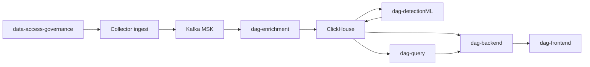

## High-Level Architecture

Detection ML reads enriched epochs from ClickHouse and writes score tables back to ClickHouse; the backend reads those tables for the dashboard. For the Detection ML path in detail, see [Detection ML Overview](/detection-ml/overview).

## Key Services

**data-access-governance:** eBPF agents on Linux that capture metadata-level telemetry and ship to the customer ingest endpoint. macOS uses a separate Apple Endpoint Security agent (`macos-edr-agent`) rather than eBPF — see [EDR Overview](/edr/overview). On AWS ECS Fargate, where eBPF isn't available, a separate seccomp+ptrace-based agent ships the same wire format — see [ECS Fargate Agent](/agents/fargate).

**dag-enrichment:** Consumes Kafka events; normalizes telemetry, builds tokens and numeric features, writes ClickHouse.

**dag-detectionML (`dag-classification`):** TRACE online scoring service; polls ClickHouse and writes `dag_trace_scores`. See [Inference](/detection-ml/inference).

**dag-backend:** Core API, auth, findings endpoints, fusion narratives.

**dag-query:** Natural-language query and MCP tools over backend APIs.

**dag-frontend:** Web UI for investigation, administration, and operational workflows.

## Data Flow

1. Collectors send metadata events through private ingest to Kafka.
2. Enrichment processes events and stores tokens, scores, and graph edges in ClickHouse.
3. Detection ML consumes enriched epochs and emits anomaly scores.
4. Backend and query layers expose data to the dashboard and APIs.

## Detection ML (summary)

| Stage | Component |
| --- | --- |
| Inputs | `dag_anomaly_scores`, `dag_epoch_tokens` |
| Scoring | TRACE + ACI/CCT in `dag-classification` |
| Outputs | `dag_trace_scores`, `dag_ttd`, `dag_ttd_calibrator` |
| Product | Anomalies page via `dag-backend` → fusion → narratives |

Full documentation: [Detection ML section](/detection-ml/overview).
