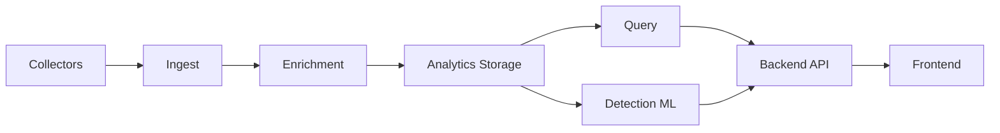

## High-Level Architecture

{/* TODO: replace with an accurate diagram once validated with the team */}

## Key Services

**Collector** — Agents on Linux and macOS that capture metadata-level telemetry and ship it to the customer ingest endpoint.

**Backend** — Core API, auth, and platform logic consumed by the dashboard and integrations.

**Enrichment** — Normalizes and enriches raw events for downstream analytics and detection.

**Detection ML** — Behavioral baselines and anomaly scoring over enriched telemetry.

**Query** — Search and historical query over stored events.

**Frontend** — Web UI for investigation, administration, and operational workflows.

{/* TODO: expand each service with repo paths and deployment notes */}

## Data Flow

1. Collectors send metadata events to the private ingest endpoint in the customer environment.
2. Enrichment processes and stores events in the analytics layer.
3. Detection models consume enriched data and emit findings.
4. The backend and query layers expose data to the dashboard and APIs.

{/* TODO: expand with sequence diagrams and failure modes */}
