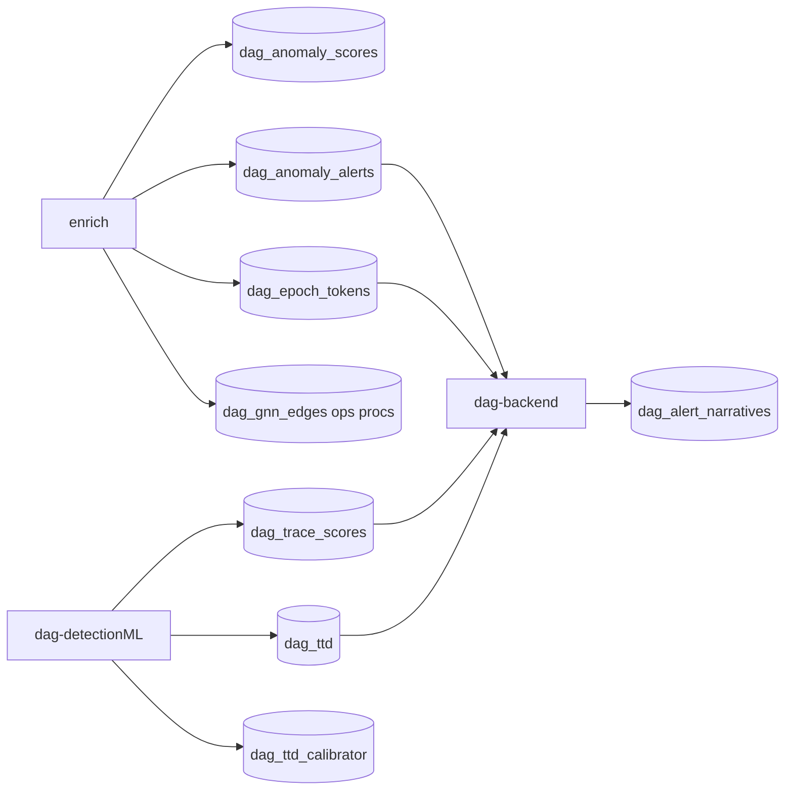

Detection ML sits in the middle of a multi-writer ClickHouse schema. This page lists tables, owning writers, and migration anchors.

## Contract diagram



## Primary ML tables

| Table | Writer | Reader | Purpose |
| --- | --- | --- | --- |
| `dag_anomaly_scores` | enrichment | ML poll, backend | 24 raw + 32 derived features and 21 per-feature z-scores per host/epoch, as named columns (statistical ensemble leg) |
| `dag_anomaly_alerts` | enrichment | backend | Thresholded statistical anomalies per host/epoch |
| `dag_epoch_tokens` | enrichment | ML + backend | Token arrays and evidence |
| `dag_trace_scores` | ML | backend, frontend | TRACE findings (ML ensemble leg) |
| `dag_ttd` | ML | backend (primary alerts path) | Time-to-detection |
| `dag_ttd_calibrator` | ML | backend | TTD display calibration |

Migrations live under [`cybe-dag-infra/schema/migrations/`](https://github.com/hilt-ai/cybe-dag-infra/tree/dev/schema/migrations). Key anchors:

- `dag_anomaly_scores`: migration `000001` family (see repo for current revision)
- `dag_trace_scores`: TRACE score columns including ACI/CCT fields
- `dag_ttd` / `dag_ttd_calibrator`: TTD product columns

Always confirm the latest migration ID in infra before citing a number in runbooks.

## GNN tables (opt-in)

| Table | Writer | Notes |
| --- | --- | --- |
| `dag_gnn_edges` | enrichment (`DAG_GNN_EDGES_ENABLED`) | Graph edges |
| `dag_gnn_ops` | enrichment | Operational nodes |
| `dag_gnn_procs` | enrichment | Process nodes |

ML training reads these offline; online GNN score writer is gated by `GNN_ENABLED` (defaults off).

## Legacy / auxiliary

| Table | Status |
| --- | --- |
| `dag_ml_scores` | Legacy TS-VAE/IF path; not written by current TRACE ML |
| Feature-cluster artifacts | S3/registry via refit runner; not the primary alert pipeline |

HDBSCAN feature-cluster refit supports fleet-behavior clustering. It is separate from legacy `dag_ml_scores` reads in older queries.

## Token contract

| Artifact | Repo | Branch |
| --- | --- | --- |
| `token_spec.yaml` | `dag-tokenspec` | `main` |
| `ATOMS.md` | `dag-tokenspec` | `main` |

Enrichment and ML must agree on tokenspec version bundled in TRACE `metadata.json`.

## Backend API contract

Primary consumer: `GET /api/anomaly-alerts` → `makeAnomalyAlertsHandler` joining `dag_trace_scores`, `dag_epoch_tokens`, `dag_ttd`, `dag_alert_narratives`.

Secondary: `queryAnomalyFindingsWindow` for widgets/export (no `dag_ttd` join).

## dag-query index boundary

The MCP docs index must embed **`docs/customer/`** MDX only. Never index `dev/` or `prospect/` paths into production `docs-index.json`.

The indexer (`BuildBundle`) walks whatever root it is given, so it must be pointed at the `docs/customer` subtree, not the docs repo root. A guard that rejects any indexed route under `/dev/` or `/prospect/` is required in `dag-query` CI (tracked separately from these docs).

Regenerate (point the builder at the customer subtree, not the repo root):

```bash
cd dag-query
go run ./cmd/docs-index -docs ../docs/customer
```

## Cross-repo change checklist

When changing a column or table:

1. Migration in `cybe-dag-infra`
2. Enrichment writer (if upstream)
3. ML reader/writer in `dag-detectionML`
4. Backend SQL handlers
5. Frontend types and UI
6. Customer docs if operator-visible

## Related

- [Inference](/detection-ml/inference)
- [Downstream](/detection-ml/downstream)
- [Architecture](/architecture)
