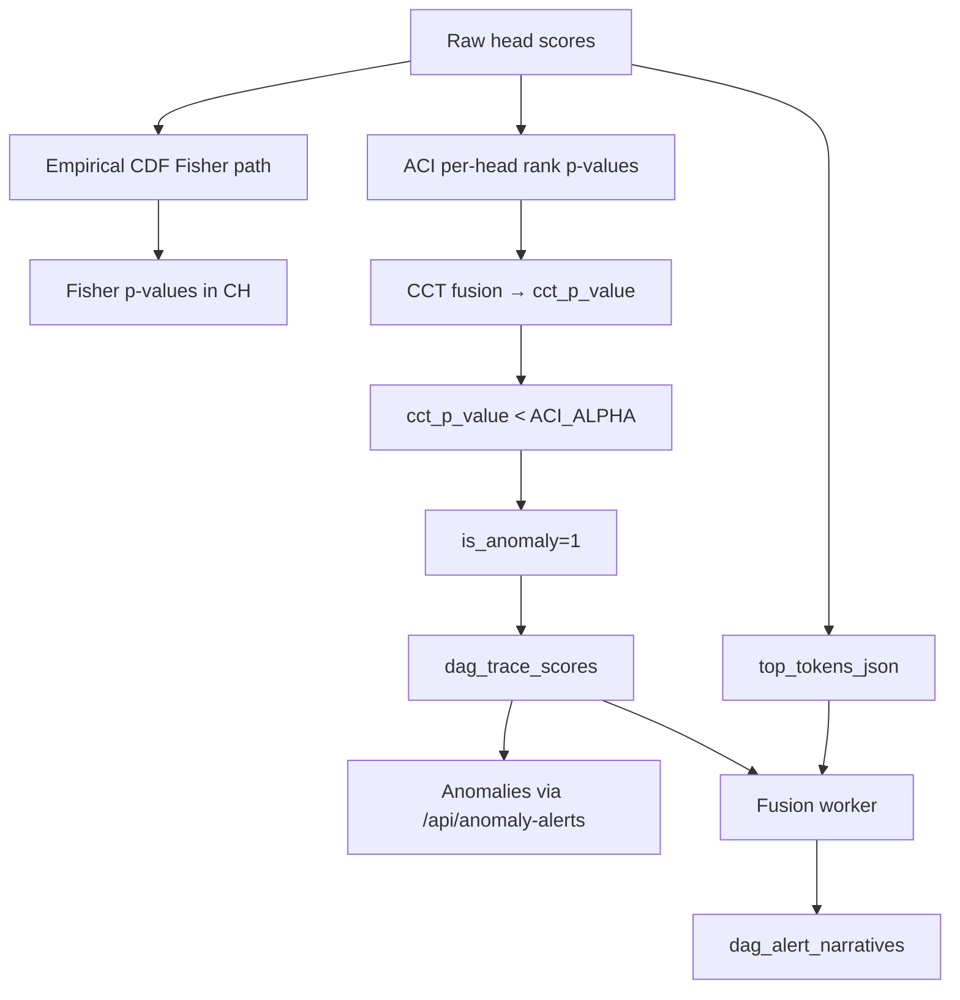

ML writes ClickHouse rows. It does not call the frontend. The backend joins scores with tokens and optional narratives, then exposes REST APIs consumed by the dashboard and integrations.

## Anomalies page (primary path)

| Layer | Location |
| --- | --- |
| Frontend API | [`alerts.ts`](https://github.com/hilt-ai/dag-frontend/blob/dev/src/api/services/alerts/alerts.ts) → `GET /api/anomaly-alerts` |
| Backend handler | [`makeAnomalyAlertsHandler`](https://github.com/hilt-ai/dag-backend/blob/dev/handlers.go) (registered in [`main.go`](https://github.com/hilt-ai/dag-backend/blob/dev/main.go)) |
| UI | [`pages/Anomalies/`](https://github.com/hilt-ai/dag-frontend/tree/dev/src/pages/Anomalies) |

**SQL joins (primary handler):**

- `dag_trace_scores` (ML findings)
- `dag_epoch_tokens` (token context)
- `LEFT JOIN dag_ttd` (time-to-detection bands)
- `LEFT JOIN dag_alert_narratives` (LLM summaries)

Frontend types include `cct_p_value` in [`types.ts`](https://github.com/hilt-ai/dag-frontend/blob/dev/src/types.ts).

## Secondary path (widgets and export)

[`queryAnomalyFindingsWindow`](https://github.com/hilt-ai/dag-backend/blob/dev/handlers.go) is a shared findings-window query used by dashboard widgets and export ([`widget_export.go`](https://github.com/hilt-ai/dag-backend/blob/dev/widget_export.go)). It joins trace scores, tokens, and narratives, and also unions detection-rule findings. It does not join `dag_ttd`, so do not use it as the Anomalies page query.

## Detection rules union

`makeAnomalyAlertsHandler` also merges detection-rule findings via `queryDetectionRuleFindings`. The Anomalies list shows both:

| Source | Origin | Pipeline |
| --- | --- | --- |
| TRACE ML | `dag_trace_scores` where `is_anomaly=1` | Enrichment → ML scoring |
| Detection rules | Rule engine matches | User-defined rules in dashboard |

They share the same UI but originate from independent pipelines. Rule findings do not pass through `dag-detectionML`.

## What the UI surfaces

- **Severity / confidence:** derived from score columns and product logic ([Detection Accuracy](https://docs.hilt.ai/dashboard/anomalies))
- **Top tokens:** from `top_tokens_json` and token joins
- **Host context:** collector and fleet metadata
- **TTD band:** from `dag_ttd` join on the primary path only

## Narratives (fusion worker)

When `FUSION_ENABLED`, the backend fusion worker ([`fusion/enrich.go`](https://github.com/hilt-ai/dag-backend/blob/dev/fusion/enrich.go)):

1. Finds uncovered TRACE alerts (`is_anomaly=1` without a narrative)
2. Pulls token evidence, top apps, cluster context
3. Calls the LLM and writes `dag_alert_narratives`

| Responsibility | Owner |
| --- | --- |
| Scorable evidence (`top_tokens_json`, PMA attention) | ML (`dag-detectionML`) |
| Natural-language story | Backend fusion |

## Decision funnel to product

## MCP / query layer

[`dag-query`](https://github.com/hilt-ai/dag-query/tree/dev) embeds `customer/` Mintlify docs for `search_docs` / `get_doc_page`. It reads telemetry via backend APIs, not ML directly. Index only `docs/customer/` MDX in dag-query (see [Data contracts](/detection-ml/data-contracts)).

## Eval tooling

Batch narrative evaluation: [`cmd/eval-narrative`](https://github.com/hilt-ai/dag-backend/blob/dev/cmd/eval-narrative/main.go) replays findings from `dag_trace_scores`.
