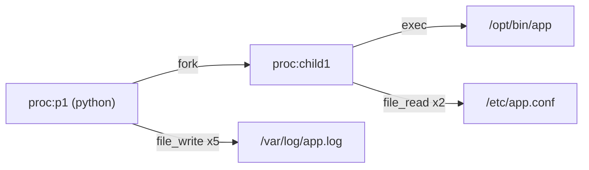
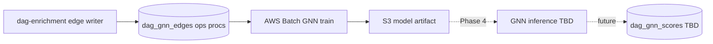
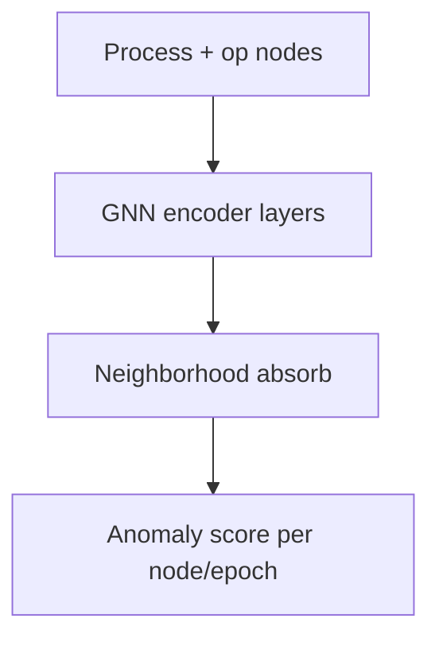
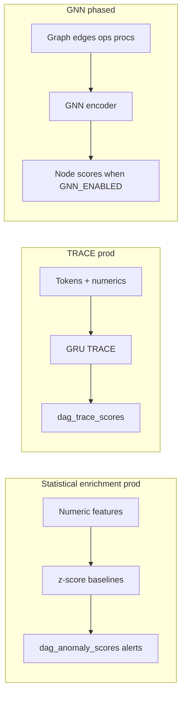

GNN (graph neural network) detection is the **graph-based leg** of the detection ensemble. **Statistical enrichment scoring** (`dag_anomaly_scores` / `dag_anomaly_alerts`) and **TRACE** (`dag_trace_scores`) are live in production. GNN edge ingestion is opt-in and online GNN inference is phased — `GNN_ENABLED` defaults to `false`, so GNN alerts are not part of default prod. This page tracks GNN status, schema, and the inference rollout path.

## Status summary

| Capability | Status |
| --- | --- |
| Statistical enrichment scoring | Prod (`dag_anomaly_scores` / `dag_anomaly_alerts`) |
| TRACE online scoring | Prod (`dag_trace_scores`) |
| Edge ingestion (`dag_gnn_*`) | Opt-in via enrichment (`DAG_GNN_EDGES_ENABLED`) |
| Offline training (AWS Batch) | Research pipeline exists |
| Live GNN inference service | Phased; `GNN_ENABLED=false` by default |
| Anomalies UI for GNN scores | Not wired in default prod |

## Why GNN

TRACE scores per-host temporal surprise over 5-minute epochs (60s sub-epochs). Statistical enrichment baselines operate over longer rolling windows on numeric features. GNN research explores cross-host and cross-process structure at graph scale: shared binaries, parent/child process trees, and operational dependencies encoded as a fleet graph.

## Enrichment inputs (opt-in)

GNN tables are written only when enrichment enables edge extraction:

| Table | Content | Writer |
| --- | --- | --- |
| `dag_gnn_edges` | Process/host graph edges | [`internal/edge/`](https://github.com/hilt-ai/dag-enrichment/tree/dev/internal/edge) |
| `dag_gnn_ops` | Operational event nodes | same |
| `dag_gnn_procs` | Process node metadata | same |

Gate: **`DAG_GNN_EDGES_ENABLED=true`** in enrichment config. Off by default; the tables stay empty until the gate is enabled, even though migrations exist.

## Example: what an edge looks like

Each row in `dag_gnn_edges` is one collapsed `(src_proc_instance_id, relation, dst_bucket)` interaction within a host-epoch; many identical syscalls are aggregated into a single edge with counts, bytes, and top-k concrete targets. `relation` is one of 11 types (`fork`, `exec`, `file_read`/`file_write`/`file_create`/`file_unlink`/…, `net_connect`, `net_accept`).

A Python process that forks a child, which then execs a binary and reads a config while the parent writes a log:

| `src_proc_instance_id` | `relation` | `dst_type` | `dst_bucket` | `event_count` | bytes |
| --- | --- | --- | --- | --- | --- |
| `proc:p1` | fork | proc | `proc:child1` | 1 | – |
| `proc:child1` | exec | file | `/opt/bin/app` | 1 | – |
| `proc:child1` | file_read | file | `/etc/app.conf` | 2 | 512 recv |
| `proc:p1` | file_write | file | `/var/log/app.log` | 5 | 2048 sent |

As a graph, with process nodes keyed by `src_proc_instance_id` (file/net destinations are `dst_bucket` targets, not first-class nodes):

`dst_bucket` is bucketed (file paths are container-scoped; network peers collapse to subnet / peer-cluster). Each edge also keeps `sub_epoch_counts` (five 1-minute bins), `topk_targets` / `topk_counts`, and `distinct_targets` for cardinality. Nodes are tied together by `src_proc_instance_id` (mandatory in the schema; empty only on the legacy metabit collector set). Full schema: [02-DATA-CONTRACT.md](https://github.com/hilt-ai/dag-detectionML/blob/dev/docs/gnn/02-DATA-CONTRACT.md).

## Lifecycle (research)

## Encoder concept

See repo diagrams: [`docs/gnn/`](https://github.com/hilt-ai/dag-detectionML/tree/dev/docs/gnn)

## Training docs

| Doc | Topic |
| --- | --- |
| [00-OVERVIEW](https://github.com/hilt-ai/dag-detectionML/blob/dev/docs/gnn/00-OVERVIEW.md) | Goals and phases |
| [02-DATA-CONTRACT](https://github.com/hilt-ai/dag-detectionML/blob/dev/docs/gnn/02-DATA-CONTRACT.md) | Graph construction from ClickHouse |
| [03-MODEL](https://github.com/hilt-ai/dag-detectionML/blob/dev/docs/gnn/03-MODEL.md) | Architecture |
| [04-TRAINING](https://github.com/hilt-ai/dag-detectionML/blob/dev/docs/gnn/04-TRAINING.md) | Batch jobs |

Phase naming in repo docs uses P1/P2/P3 for milestones; **Phase 4** specifically means live inference service integration.

## Known limitations

- `GNN_ENABLED` defaults to `false`; even though `ENABLED_MODELS` includes a `gnn` entry, the scoring loop does not start without an explicit enable and a loaded bundle — not "GNN alerts in prod" today
- No `dag_gnn_scores` table or backend handler wired in default prod
- Graph freshness depends on enrichment edge writer lag
- Evaluation harness is offline only; no dashboard TTD or narratives path for GNN yet
- TRACE, statistical enrichment, and GNN operate at different epoch/window lengths; they coexist as separate finding sources in the ensemble vision

## Ensemble: TRACE vs statistical vs GNN

## Related

- [Overview](/detection-ml/overview)
- [Data contracts](/detection-ml/data-contracts)
- [Training on Batch](/detection-ml/training-batch)
