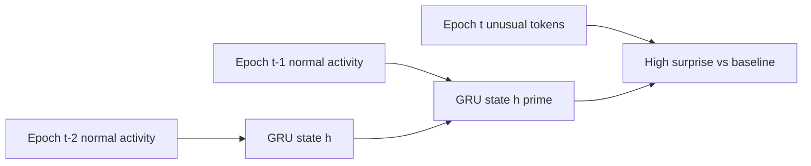

The production scoring path is pull-based: the service polls ClickHouse for new enrichment epochs, scores them with TRACE, and writes results back. There is no request/response scoring API.

## Poll interval

Default `ML_POLL_INTERVAL` is 30 seconds ([`config.py`](https://github.com/hilt-ai/dag-detectionML/blob/dev/src/config.py)). Each tick, [`ClickHouseConsumer`](https://github.com/hilt-ai/dag-detectionML/blob/dev/src/consumer.py) fetches rows with `wall_time_ns` ahead of the watermark.

Only rows with `` `group` = 'EPOCH' `` in `dag_anomaly_scores` are scored.

## Poll and watermark (dual-table semantics)

Poll source and cursor behavior use two tables. Do not assume the watermark lives only on `dag_trace_scores`.

| Step | Table | Behavior |
| --- | --- | --- |
| Poll source | `dag_anomaly_scores` (`ML_SOURCE_TABLE`) | New epoch rows fetched each tick |
| Cold-start cursor seed | `dag_trace_scores` | `max(wall_time_ns)` initializes watermark on startup |
| Per-tick advance | `dag_anomaly_scores` | Watermark advances to max `wall_time_ns` in polled source rows **when rows are fetched**, before scoring completes |

When diagnosing lag, inspect both enrichment input volume on `dag_anomaly_scores` and scored output on `dag_trace_scores`.

If a scoring tick fails after poll, those epochs are not retried automatically because the watermark already advanced. Ops may need to rewind the watermark manually after fixing the root cause.

## Inputs from enrichment

Poll source is `dag_anomaly_scores`, not token rows alone. See [TRACE inference pipeline](https://github.com/hilt-ai/dag-detectionML/blob/dev/docs/trace/02-inference-pipeline.md) section 2.

| Table | Writer | ML use |
| --- | --- | --- |
| `dag_anomaly_scores` | [`scorewriter.go`](https://github.com/hilt-ai/dag-enrichment/blob/dev/internal/scoring/scorewriter.go) | 20-D numeric vector per host/epoch |
| `dag_epoch_tokens` | [`token_writer.go`](https://github.com/hilt-ai/dag-enrichment/blob/dev/internal/features/token_writer.go) | Token arrays, side features, evidence JSON |

## Epoch timing

- **Scoring epoch:** 5-minute window per host
- **Sub-epochs:** five 60-second slices (`token_sub_epochs` 0–4) for within-epoch causal mixing
- Token vocabulary: [`dag-tokenspec`](https://github.com/hilt-ai/dag-tokenspec) and [token vocabulary doc](https://github.com/hilt-ai/dag-detectionML/blob/dev/docs/trace/05-token-vocabulary.md)

## TRACE scoring loop

1. Load the artifact bundle (`model_scripted.pt`, `metadata.json`, `calibration.npz`, `calibration.json`).
2. For each host epoch, `TraceStateManager.score_batch()` updates per-host GRU state ([`trace_state.py`](https://github.com/hilt-ai/dag-detectionML/blob/dev/src/inference/trace_state.py)).
3. Run `encode_epoch`, GRU `score_step`, and token surprise ([`trace_wrapper.py`](https://github.com/hilt-ai/dag-detectionML/blob/dev/src/inference/trace_wrapper.py)) to produce **raw head scores**.
4. **In parallel on raw scores:**
   - **Fisher path:** `calibrate_scores()` writes empirical-CDF Fisher p-values for dashboards and offline comparison.
   - **Alert path:** [`ACIManager.score_epoch`](https://github.com/hilt-ai/dag-detectionML/blob/dev/src/inference/aci.py) computes per-head ACI (adaptive conformal inference) rank p-values, then CCT (Cauchy-combined test) fuses them into `cct_p_value`.
5. Set **`is_anomaly = (cct_p_value < ACI_ALPHA)`** when ACI is enabled.
6. On alert onset, write TTD rows to `dag_ttd`.

Fisher columns remain in ClickHouse when ACI is active, but **`is_anomaly` follows CCT**, not Fisher.

## Warmup and burn-in

- GRU hidden state persists per host across epochs (not global).
- **GRU warmup** (`TRACE_WARMUP_THRESHOLD`, default 3): scoring rows are skipped; only hidden state is updated.
- **ACI burn-in** (`ACI_BURNIN`, default 50): per-head p-values return 0.5 until history fills.
- On service restart, ACI state replays from ClickHouse via `reconstruct_from_ch()`.

## Outputs written

| Table | Key columns for downstream |
| --- | --- |
| `dag_trace_scores` | `is_anomaly`, `cct_p_value`, `fisher_p_value`, head p-values, `top_tokens_json`, `attention_links_json`, `model_version` |
| `dag_ttd` | Detection latency (`ttd_seconds`, bands) |
| `dag_ttd_calibrator` | Maps raw TTD scores to display intervals for the dashboard |

## HTTP surface

| Endpoint | Purpose |
| --- | --- |
| `GET /health` | Liveness |
| `GET /ready` | Readiness (models loaded) |
| `GET /models` | Loaded model metadata |
| `GET /metrics` | Prometheus metrics |

## Model refresh

- **Hot-pull:** Postgres model registry, decrypt, swap TRACE bundle ([`model_refresh.py`](https://github.com/hilt-ai/dag-detectionML/blob/dev/src/model_refresh.py))
- **On-prem lifecycle:** gated by `ONPREM_ENABLED` ([`config.py`](https://github.com/hilt-ai/dag-detectionML/blob/dev/src/config.py))

## Equation cheat sheet

Decision-point math only. Full specs are in [TRACE repo docs](https://github.com/hilt-ai/dag-detectionML/tree/dev/docs/trace).

**Predictive surprise** (per timestep):

$$\|z_t - \hat{z}_t\|^2 \quad \text{where} \quad \hat{z}_t = \text{PredictiveHead}(h_{t-1})$$

**Density** (inference uses beta=1):

$$\text{NLL} = \text{mahalanobis}(z_t, \mu, \sigma) + \log\det(\sigma)$$

**Empirical CDF** (per head, from calibration quantiles; feeds Fisher path):

$$p = \max\left(\frac{|\{s_i \in \text{cal} : s_i > s\}|}{|\text{cal}|},\; 10^{-10}\right)$$

The implementation uses `searchsorted(..., side="right")` (strict `>`) and floors the result at `1e-10`.

**Fisher** (reference / offline eval):

$$T = -2\sum_{h=1}^{3}\ln p_h, \quad p_F = \chi^2.\text{sf}(T/s,\; df)$$

**Production alert path:** ACI rank p-values per head (from **raw** scores) → CCT fusion → compare `cct_p_value` to `ACI_ALPHA`. See [ACI + CCT scoring](https://github.com/hilt-ai/dag-detectionML/blob/dev/docs/trace/32-aci-cct-scoring.md).

## Symbol glossary

| Symbol / field | Meaning |
| --- | --- |
| z_t | Fused epoch embedding (tokens + numerics) |
| h_t | Per-host GRU hidden state |
| `predictive_surprise` | Raw predictive head score |
| `conditional_density` | Raw density head score |
| `token_surprise` | Raw token reconstruction score |
| `cct_p_value` | Cauchy-combined p-value across ACI head p-values |
| `is_anomaly` | Production alert flag (CCT threshold) |
