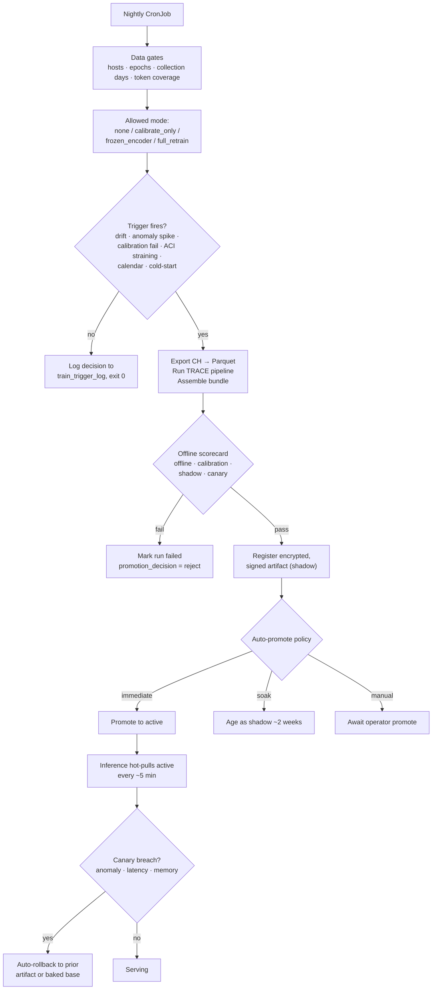

On-prem deployments train TRACE **on the customer's own cluster**. No telemetry, parquet, or model artifact from the training pipeline leaves the site. (A separate, approval-gated anonymized data-export pipeline can still send aggregate statistical features to Hilt for cross-fleet model improvement — see [Anonymized data export](https://docs.hilt.ai/on-prem/data-export-overview).) Unlike cloud training, there is no human in the loop by default: a scheduled job decides when to train, trains, gates the result, and promotes or rolls back on its own. This page covers how that loop works and what controls it. Full design: [53-onprem-autonomous-lifecycle-handoff.md](https://github.com/hilt-ai/dag-detectionML/blob/dev/docs/trace/53-onprem-autonomous-lifecycle-handoff.md).

## On-prem vs cloud training

| | Cloud (AWS Batch) | On-prem |
| --- | --- | --- |
| Trigger | Engineer submits a job | Nightly CronJob self-decides |
| Data | Read from dev/prod ClickHouse | On-site ClickHouse only; no egress |
| Artifacts | S3 + Postgres registry | Encrypted + signed on a shared volume (EFS); on-site Postgres registry |
| Promotion | Manual via `promote_model.py` | Policy-driven (immediate / soak / manual) |
| Safety net | Engineer review | Offline scorecard + live canary auto-rollback |

The whole path is gated by **`ONPREM_ENABLED`** (default `false`); it stays dormant in cloud/dev builds.

## Lifecycle

The CronJob runs `python -m src.onprem.lifecycle train --respect-trigger`:

## The three decision points

1. **Data gates → allowed mode.** Before anything, `data_gates.py` checks whether enough clean telemetry exists (min hosts, epochs per host, benign epochs, collection days, tokenizer coverage, OOV rate). The result caps *how much* the run may change the model: `none`, `calibrate_only`, `frozen_encoder` (default), or `full_retrain`.
2. **Trigger → should we train at all.** `train_trigger.py` fires on persistent feature drift (PSI over threshold across multiple windows), an anomaly-rate spike, a calibration-uniformity failure, or labeled-quality decay, but only when **ACI is straining** (θ ≥ `ONPREM_ACI_THETA_ABSORB`), so drift the online conformal layer already absorbs does not cause a needless retrain. A weekly calendar ceiling and cold-start (no active model yet) also trigger. Every evaluation is logged to `train_trigger_log` whether it trains or not.
3. **Scorecard → is the new model safe.** After training, `promote.py` runs up to four gates in order: **offline** (artifacts load as TorchScript, calibration uniform, no metric regression vs champion), **calibration** (alert frequency on presumed-normal data inside the binomial CI at `ONPREM_OPERATIONAL_ALPHA`), **shadow** (soak policy only), and **canary** (live traffic). Any failure rejects the artifact.

## Promotion policies and rollback

`ONPREM_AUTO_PROMOTE_POLICY` decides what happens after a passing scorecard:

- **`immediate`** (default): promote to active now; the live canary + auto-rollback are the safety net.
- **`soak`**: register as shadow and age it (~2 weeks) before a separate `lifecycle promote` job evaluates the soak gate.
- **`manual`**: register as shadow and wait for an operator to click **Promote** in the admin dashboard.

The serving process ([`model_refresh.py`](https://github.com/hilt-ai/dag-detectionML/blob/dev/src/model_refresh.py)) hot-pulls the active artifact every `MODEL_REFRESH_INTERVAL_SECONDS` (~5 min). If a freshly promoted model breaches a canary threshold (anomaly-rate, p95 latency, or memory over its multiplier), it is auto-demoted and the prior archived artifact (or the baked-in base model) is reactivated.

## Key config

Full set and defaults live in [`config.py`](https://github.com/hilt-ai/dag-detectionML/blob/dev/src/config.py) (§ on-prem); the most load-bearing:

| Setting | Default | Controls |
| --- | --- | --- |
| `ONPREM_ENABLED` | `false` | Master gate for the entire on-prem path |
| `ONPREM_TRAIN_MODE` | `frozen_encoder` | Requested training mode (capped to the data-allowed mode) |
| `ONPREM_ACI_THETA_ABSORB` | `0.05` | ACI must be straining above this before drift triggers a retrain |
| `ONPREM_AUTO_PROMOTE_POLICY` | `immediate` | `immediate` / `soak` / `manual` |
| `ONPREM_OPERATIONAL_ALPHA` | `0.01` | Target alert frequency for the calibration gate |
| `MODEL_REFRESH_INTERVAL_SECONDS` | `300` | Hot-pull cadence for the serving process |

Data-sufficiency and drift thresholds (`ONPREM_MIN_*`, `ONPREM_DRIFT_*`) and canary multipliers (`ONPREM_CANARY_ANOMALY_RATE_MULT`, `ONPREM_LATENCY_P95_MULT`, `ONPREM_MEMORY_MULT`) are documented in [50-onprem-data-requirements.md](https://github.com/hilt-ai/dag-detectionML/blob/dev/docs/trace/50-onprem-data-requirements.md) and the handoff doc.

## Related

- [Model Lifecycle](https://docs.hilt.ai/on-prem/model-lifecycle): the customer-facing view of trigger recommendations, training progress, and the promote/rollback UI
- [Training on Batch](/detection-ml/training-batch): cloud/offline training
- [Inference](/detection-ml/inference): how the promoted model scores in production
- [Overview](/detection-ml/overview#on-prem-model-lifecycle)
