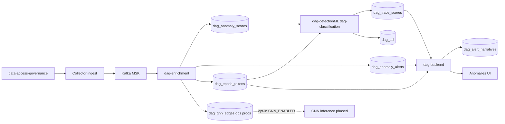

Detection ML is one leg of a multi-model **ensemble**. **dag-enrichment** writes per-host statistical baselines and z-scores to `dag_anomaly_scores` (and thresholded rows to `dag_anomaly_alerts`) on every 5-minute epoch. **dag-detectionML** (`dag-classification`) polls those rows plus token sequences and runs **TRACE** online scoring → `dag_trace_scores`. A **GNN** graph leg is architected for cross-host provenance (edge tables opt-in; online inference gated by `GNN_ENABLED`, off by default). The backend exposes findings on the [Anomalies](https://docs.hilt.ai/dashboard/anomalies) page and, through fusion, on LLM [narratives](https://docs.hilt.ai/dashboard/anomalies). Model math lives in the [dag-detectionML](https://github.com/hilt-ai/dag-detectionML/tree/dev/docs) repo.

## Service identity

The always-on scoring service deploys as **`dag-classification`** on EKS. It runs a FastAPI shell (`/health`, `/ready`, `/models`, `/metrics`) plus a background poll loop that scores new epochs from ClickHouse. There is no public `/score` REST API.

Entrypoint: [`src/main.py`](https://github.com/hilt-ai/dag-detectionML/blob/dev/src/main.py) · Deployment: [`k8s/deployment.yaml`](https://github.com/hilt-ai/dag-detectionML/blob/dev/k8s/deployment.yaml)

## Prod vs research

| Capability | Status | Notes |
| --- | --- | --- |
| Statistical enrichment scoring | Prod | Per-host z-score baselines over longer rolling windows → `dag_anomaly_scores` / `dag_anomaly_alerts` in [`dag-enrichment/internal/scoring/`](https://github.com/hilt-ai/dag-enrichment/tree/dev/internal/scoring) |
| TRACE online scoring | Prod | Always-on poll loop; `ENABLED_MODELS["trace"]` (hardcoded dict, not an env var). 5-min epochs with 60s sub-epochs |
| ACI + CCT alerting | Prod | Adaptive conformal inference (ACI) + Cauchy-combined test (CCT); `is_anomaly` when `cct_p_value < ACI_ALPHA` |
| TTD (time-to-detection) | Prod | `dag_ttd` and `dag_ttd_calibrator` tables |
| HDBSCAN feature-cluster refit | Prod auxiliary | Fleet-behavior clustering via refit artifacts; not the primary detector. Legacy `dag_ml_scores` is not written by current ML |
| GNN edge ingestion | Opt-in | `DAG_GNN_EDGES_ENABLED=true` in enrichment; tables empty until enabled |
| GNN online inference | Phased / off by default | `ENABLED_MODELS` includes a `gnn` entry but `GNN_ENABLED` defaults to `false`; no GNN alerts in default prod |
| GNN training pipeline | Research | AWS Batch, offline; see [GNN](/detection-ml/gnn) |
| TS-VAE + Isolation Forest | Deprecated | Removed from runtime; legacy `dag_ml_scores` is no longer written (see [README deprecated appendix](https://github.com/hilt-ai/dag-detectionML/blob/dev/README.md)) |

## Platform flow

GNN edge tables are written only when `DAG_GNN_EDGES_ENABLED=true` in enrichment (off by default).

See [Inference](/detection-ml/inference) for the poll loop and scoring path, and [Downstream](/detection-ml/downstream) for how scores reach the dashboard.

## Upstream: enrichment scoring

Before ML runs, **dag-enrichment** builds two inputs per host per 5-minute epoch:

- **Numeric features and statistical baselines** (20-D vector, z-scores over rolling windows) to `dag_anomaly_scores` and thresholded rows to `dag_anomaly_alerts` via [`internal/scoring/`](https://github.com/hilt-ai/dag-enrichment/tree/dev/internal/scoring) — this is a first-class detection leg, not just preprocessing for TRACE
- **Token sequences** to `dag_epoch_tokens` via [`internal/features/token_writer.go`](https://github.com/hilt-ai/dag-enrichment/blob/dev/internal/features/token_writer.go)

TRACE fuses token embeddings with the numeric vector from enrichment. ML polls `dag_anomaly_scores` for new epochs; it does not recompute enrichment features.

## Auxiliary: feature-cluster refit

HDBSCAN feature-cluster models support fleet-behavior clustering (not primary anomaly detection). The service periodically refits and reloads cluster artifacts via [`refit_runner.py`](https://github.com/hilt-ai/dag-detectionML/blob/dev/src/refit_runner.py) and the background loop in [`main.py`](https://github.com/hilt-ai/dag-detectionML/blob/dev/src/main.py). This path is separate from legacy `dag_ml_scores` reads in older fleet-behavior queries.

## On-prem model lifecycle

Autonomous train/eval/promote flows are gated by `ONPREM_ENABLED` and related `ONPREM_*` settings in [`config.py`](https://github.com/hilt-ai/dag-detectionML/blob/dev/src/config.py). See [On-prem autonomous training](/detection-ml/on-prem-training) for the full lifecycle. Customer-facing overview: [Model Lifecycle](https://docs.hilt.ai/on-prem/model-lifecycle). Engineering handoff: [onprem lifecycle doc](https://github.com/hilt-ai/dag-detectionML/blob/dev/docs/trace/53-onprem-autonomous-lifecycle-handoff.md).

## Repo map

| Repo | Key paths | Role |
| --- | --- | --- |
| `data-access-governance` | eBPF probes, event structs | Kernel telemetry capture |
| `dag-enrichment` | `internal/features/`, `internal/scoring/`, `internal/edge/` | Writes scores, tokens, optional GNN edges |
| `dag-detectionML` | `src/inference/`, `training/pipelines/` | TRACE online scoring; offline training |
| `dag-tokenspec` | `token_spec.yaml`, `ATOMS.md` | Token vocabulary contract |
| `cybe-dag-infra` | `schema/migrations/` | ClickHouse schema |
| `dag-backend` | `handlers.go`, `fusion/` | Findings API, narratives |
| `dag-frontend` | `pages/Anomalies/` | Analyst UI |
| `dag-query` | `internal/docs/` | MCP tools; embeds customer docs only |

## Reading order

1. [Inference](/detection-ml/inference): poll loop, ACI/CCT, outputs
2. [Downstream](/detection-ml/downstream): Anomalies page, fusion, narratives
3. [TRACE](/detection-ml/trace): model at a glance
4. [GNN](/detection-ml/gnn): research path and status
5. [Data contracts](/detection-ml/data-contracts): tables and migrations
6. [Local development](/detection-ml/local-development): smoke tests and Python setup
7. [Training on Batch](/detection-ml/training-batch): AWS Batch jobs and experiment gating

Deep dives: [TRACE docs index](https://github.com/hilt-ai/dag-detectionML/blob/dev/docs/trace/README.md) · [GNN overview](https://github.com/hilt-ai/dag-detectionML/blob/dev/docs/gnn/00-OVERVIEW.md)

## Customer docs (operator view)

- [Detection Accuracy](https://docs.hilt.ai/dashboard/detection-accuracy): cold start, severity, confidence
- [Anomalies](https://docs.hilt.ai/dashboard/anomalies): triage workflow
- [Model Lifecycle](https://docs.hilt.ai/on-prem/model-lifecycle): promotion and rollback
