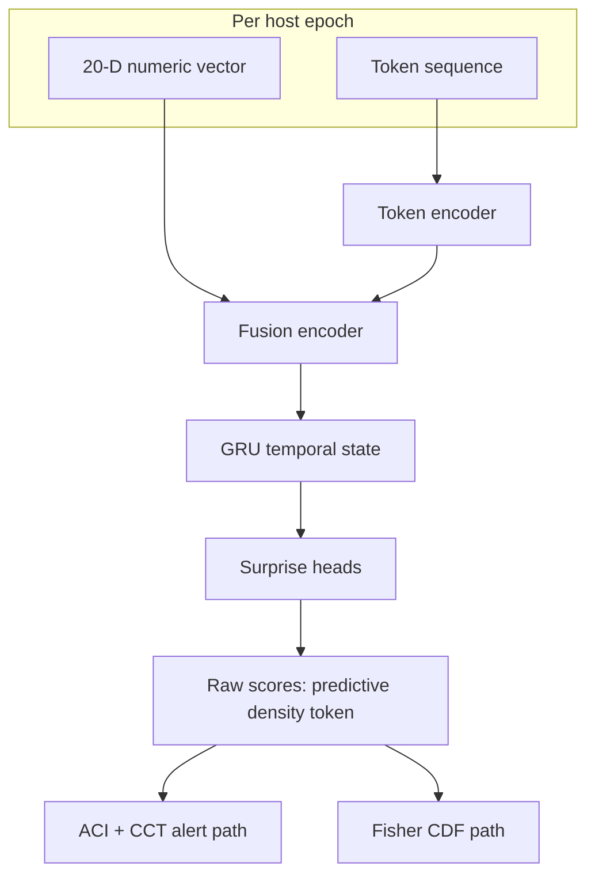
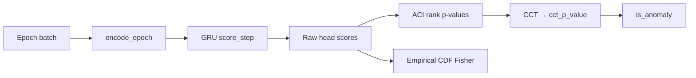

TRACE (Temporal Reconstruction And Contextual Encoding) is the production anomaly detector. It fuses token sequences and numeric enrichment features into per-epoch surprise scores.

## At a glance

| Property | Value |
| --- | --- |
| Status | Production (`ENABLED_MODELS = {"trace": ...}`) |
| Input | 20-D numeric vector (20 features selected from the 32-element `derived_features`) + token sequence per host/epoch |
| Output | Raw head scores → ACI (adaptive conformal inference) / CCT (Cauchy-combined test) alert path + Fisher calibration columns |
| State | Per-host GRU hidden state across epochs |
| Artifact bundle | `model_scripted.pt`, `metadata.json`, `calibration.npz`, `calibration.json` |

Deep dive: [TRACE docs index](https://github.com/hilt-ai/dag-detectionML/blob/dev/docs/trace/README.md)

## Architecture



## Numeric example

For one host epoch, enrichment might write:

| Field | Example | Notes |
| --- | --- | --- |
| `raw_exec_intensity` | 12.4 | Not `exec_count`; names match enrichment schema |
| `raw_net_share` | 0.42 | Share of network activity in the epoch (see `scorewriter.go`) |
| Token sequence | `[PROC:unknown_tmp, PROC:unknown_deep, FILE:read_config]` | From `dag_epoch_tokens` (see below) |

TRACE fuses these into embedding `z_t`, updates GRU state, and emits three raw head scores before calibration.

## Forward pass (inference)



Implementation: [`trace_wrapper.py`](https://github.com/hilt-ai/dag-detectionML/blob/dev/src/inference/trace_wrapper.py), [`trace_state.py`](https://github.com/hilt-ai/dag-detectionML/blob/dev/src/inference/trace_state.py)

## Token contract

Vocabulary and atom definitions live in [`dag-tokenspec`](https://github.com/hilt-ai/dag-tokenspec):

- [`token_spec.yaml`](https://github.com/hilt-ai/dag-tokenspec/blob/main/token_spec.yaml)
- [`ATOMS.md`](https://github.com/hilt-ai/dag-tokenspec/blob/main/ATOMS.md) (use `main`; repo has no `dev` branch)

Enrichment emits tokens via [`token_writer.go`](https://github.com/hilt-ai/dag-enrichment/blob/dev/internal/features/token_writer.go). ML must stay aligned with tokenspec version pinned in the artifact `metadata.json`.

### Example: one epoch's tokens

Tokens are stored as **integer IDs** (`token_ids Array(UInt16)`, vocabulary 0–172), not strings. The `FAMILY:descriptor` names are the human-readable decoding from the spec. Each epoch row in `dag_epoch_tokens` holds parallel same-length side-arrays, and every token carries the 60-second sub-epoch (0–4) it fell in:

```json
{
  "token_ids":        [10, 11, 11, 42],
  "token_sub_epochs": [ 0,  0,  1,  2],
  "token_counts":     [ 1,  2,  2,  1],
  "token_depths":     [ 0,  1,  1,  2],
  "token_roles":      [ 0,  1,  1,  0]
}
```

Decoded against `token_spec.yaml`:

| Token ID | Name | Sub-epoch (60s slice) | Role |
| --- | --- | --- | --- |
| 10 | `PROC:unknown_tmp` | 0 (0–59s) | actor |
| 11 | `PROC:unknown_deep` | 0 (0–59s) | relationship |
| 11 | `PROC:unknown_deep` | 1 (60–119s) | relationship |
| 42 | `FILE:read_config` | 2 (120–179s) | actor |

`token_evidence_json` carries the raw evidence (process names, paths, IPs) behind each token for the Anomalies UI and narratives; it is not fed to the model. Full vocabulary and worked examples: [05-token-vocabulary.md](https://github.com/hilt-ai/dag-detectionML/blob/dev/docs/trace/05-token-vocabulary.md), [40-examples.md](https://github.com/hilt-ai/dag-detectionML/blob/dev/docs/trace/40-examples.md).

## Training pipeline

| Stage | Doc | Script area |
| --- | --- | --- |
| Data prep | [01-data-contract](https://github.com/hilt-ai/dag-detectionML/blob/dev/docs/trace/01-data-contract.md) | `training/pipelines/trace.py` |
| Training | [03-training-pipeline](https://github.com/hilt-ai/dag-detectionML/blob/dev/docs/trace/03-training-pipeline.md) | AWS Batch / local |
| Calibration | [30-calibration](https://github.com/hilt-ai/dag-detectionML/blob/dev/docs/trace/30-calibration.md) | `calibration.npz` quantiles |
| Inference | [02-inference-pipeline](https://github.com/hilt-ai/dag-detectionML/blob/dev/docs/trace/02-inference-pipeline.md) | `src/inference/` |
| ACI/CCT | [32-aci-cct-scoring](https://github.com/hilt-ai/dag-detectionML/blob/dev/docs/trace/32-aci-cct-scoring.md) | `src/inference/aci.py` |

For AWS Batch jobs and experiment gating, see [Training on Batch](/detection-ml/training-batch).

## Explainability

Production explainability columns on `dag_trace_scores`:

- **`top_tokens_json`:** highest-surprise tokens for the epoch
- **`attention_links_json`:** PMA (pairwise multiplicative attention) links between token pairs when enabled in the artifact

These feed the Anomalies UI and the fusion worker for narrative context. They are not used for the alert threshold itself.

## Related

- [Inference in production](/detection-ml/inference)
- [Data contracts](/detection-ml/data-contracts)
- [Downstream](/detection-ml/downstream)
