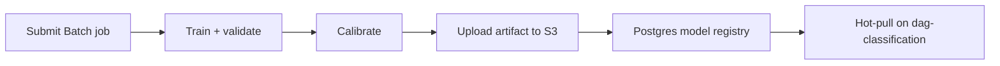

Production scoring uses hot-loaded artifacts. Training runs offline on AWS Batch (or locally for dev) and promotes bundles through the model registry.

## Primary runbooks

| Topic | Location |
| --- | --- |
| TRACE training pipeline | [`docs/trace/03-training-pipeline.md`](https://github.com/hilt-ai/dag-detectionML/blob/dev/docs/trace/03-training-pipeline.md) |
| Data pipeline | [`docs/trace/01-data-contract.md`](https://github.com/hilt-ai/dag-detectionML/blob/dev/docs/trace/01-data-contract.md) |
| Calibration | [`docs/trace/30-calibration.md`](https://github.com/hilt-ai/dag-detectionML/blob/dev/docs/trace/30-calibration.md) |
| GNN training | [`docs/gnn/04-TRAINING.md`](https://github.com/hilt-ai/dag-detectionML/blob/dev/docs/gnn/04-TRAINING.md) |
| Batch scripts | [`scripts/batch/`](https://github.com/hilt-ai/dag-detectionML/tree/dev/scripts/batch) |

Note: `training_batch_runbook.md` was removed from the `dev` branch; use `03-training-pipeline.md` and `scripts/batch/` instead.

## Job flow

## Experiment gating

Before promoting an artifact:

1. Offline metrics meet thresholds recorded in [`docs/trace/EXPERIMENT_LOG.md`](https://github.com/hilt-ai/dag-detectionML/blob/dev/docs/trace/EXPERIMENT_LOG.md)
2. Calibration quantiles cover production score ranges
3. ACI burn-in behavior validated on replay window
4. On-prem: `ONPREM_*` promotion gates if applicable

See [`docs/trace/`](https://github.com/hilt-ai/dag-detectionML/tree/dev/docs/trace) for evaluation harnesses and [`docs/trace/EXPERIMENT_LOG.md`](https://github.com/hilt-ai/dag-detectionML/blob/dev/docs/trace/EXPERIMENT_LOG.md) for recorded runs.

## Infra

Batch job definitions and IAM live in [`cybe-dag-infra`](https://github.com/hilt-ai/cybe-dag-infra). ClickHouse read credentials are injected via task secrets, not baked into images.

This page covers cloud/offline training. For customer-site autonomous training (no data egress, self-gating, auto-promote/rollback), see [On-prem autonomous training](/detection-ml/on-prem-training).

## Related

- [TRACE model](/detection-ml/trace)
- [GNN research](/detection-ml/gnn)
- [On-prem training](/detection-ml/on-prem-training)
- [Local development](/detection-ml/local-development)
