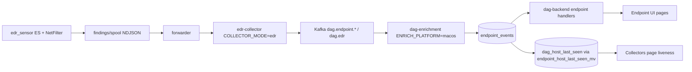

EDR is the internal codename for the macOS endpoint telemetry and detection engine — externally documented as the [macOS Collector](https://docs.hilt.ai/macos-collector/layout). This section walks engineers through the full flow from the Endpoint Security (ES) sensor on a Mac to the `endpoint_events` table the dashboard reads. Agent internals live in the [macos-edr-agent](https://github.com/hilt-ai/macos-edr-agent) repo.

## Components

| Component | Repo / path | Language | Role |
| --- | --- | --- | --- |
| `edr_sensor` / `edr_engine` | `macos-edr-agent/EDR/` | C / Obj-C | ES telemetry capture, event normalization to `evt_t`, pure-C detection rules (tamper, data movement, credential/privacy), NDJSON findings output |
| **ESensor** | `macos-edr-agent/ESensor/` | Obj-C | ES system extension host (`Hilt.EDRApp.ESensor`), restricted `endpoint-security.client` entitlement |
| **NetFilter** | `macos-edr-agent/NetFilter/` | Obj-C | NetworkExtension content-filter appex; per-flow process/bundle attribution |
| **forwarder** | `macos-edr-agent/forwarder/` | Go | Tails findings/spool NDJSON, batches, POSTs to the collector edge; stamps `machine.host_type=macos` |
| **updater** | `macos-edr-agent/updater/` | — | Self-update daemon; launchd plists under `deploy/` |
| **edr-collector** | [edr-collector](https://github.com/hilt-ai/edr-collector) | Go | Deploy fork of dag-collector at the authenticated public edge; `COLLECTOR_MODE=edr` |
| **enrichment (macos)** | [dag-enrichment](https://github.com/hilt-ai/dag-enrichment) `internal/platform/macos/` | Go | `ENRICH_PLATFORM=macos` deployment; normalizes agent JSON and writes `endpoint_events` |

## Platform flow

Kafka topics are partitioned by `host_id` (the Linux path partitions by `cgroup_id`) for per-host fault isolation. Batch ingestion requires the `X-DAG-Agent-Version` header plus `batch_id`, `host_id`, `boot_id`, `wall_time_ns`; in `edr` mode the collector additionally enforces ed25519 per-batch authentication (fail-closed unless `EDR_AUTH=off`).

## Where things land

| Table | Written by | Read by | Notes |
| --- | --- | --- | --- |
| `endpoint_events` | enrichment (macos) | `dag-backend` `endpoint_*_handlers.go` | One wide table typed by `event_class`/`event_type`; see [Data Model](/edr/data-model) |
| `dag_host_last_seen` | `endpoint_host_last_seen_mv` (migration 000054) | Collectors page, overview counts | Gives EDR hosts the same liveness path as Linux hosts |
| `dag_edr_agent` | enrichment (heartbeats, topic `dag.edr`) | dashboard header device names | ReplacingMergeTree by `host_id`; not the liveness source |
| `dag_edr_events` / `dag_edr_raw` | enrichment | findings pages, raw-evidence drawer | Findings + ES/NE evidence joined by `incident_id` |

See [Agent](/edr/agent) for the sensor and detection engine, [Pipeline](/edr/pipeline) for forwarder → collector → enrichment, and [Data Model](/edr/data-model) for the `endpoint_events` schema and its caveats.
