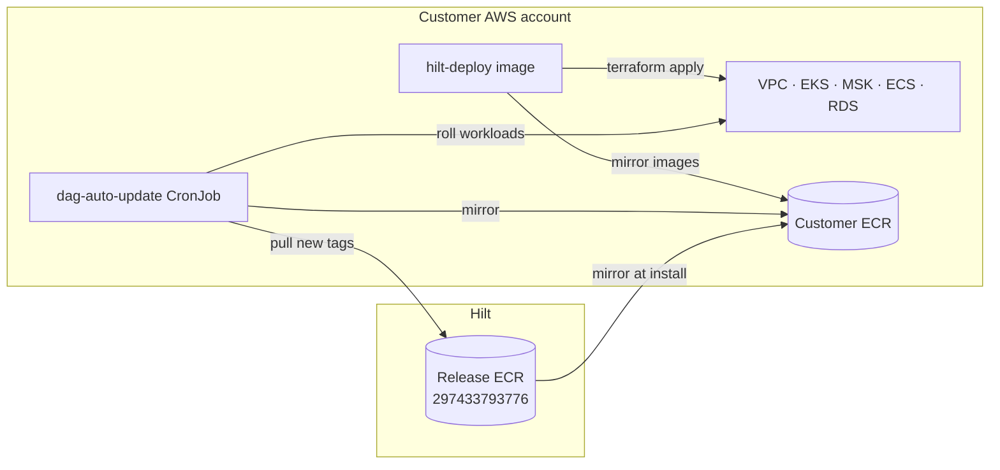

Infra v2 is the current way Hilt is deployed into a customer's own AWS account (BYOC).
It replaces the old model of handing the customer editable Terraform. Instead the customer
runs **one signed installer image** against a **small JSON config**, and ongoing updates are
handled by an **in-cluster agent that pulls from Hilt** — Hilt holds no standing access into
the customer's environment.

<Info>
  Source of truth is the **`hilt/infra`** repo (AWS only, for now). This page documents the
  as-built deployment flow; the installer's own reference is
  `installer/hilt-deploy/README.md` and the data-plane stack is `envs/byoc/README.md`.
</Info>

## Posture (what makes this safe for both sides)

- **Customer never edits Terraform.** The entire module tree is baked into the `hilt/deploy`
  image at build time. The customer's whole surface is the bounded `values.json` — if a field
  isn't in the schema, it can't be set. This is what stops deploy engineers (and customers)
  from modifying and breaking the infra.
- **Zero standing Hilt access.** There is no Hilt-run control plane reaching into the account.
  The only Hilt-hosted thing is a release container registry (ECR) that the customer's account
  *pulls* from.
- **The update agent can't destroy data.** The in-cluster `dag-auto-update` agent runs under an
  IRSA role capped by a permissions boundary that **denies** destructive actions on stateful
  stores (RDS / MSK / EBS / ClickHouse-EC2 / AWS Backup) — enforced by policy, not promise.
- **Data stays in the customer account.** All telemetry, ClickHouse data, and backups live in
  the customer's own VPC / object storage.



## Prerequisites

<Warning>
  AWS only. The customer supplies the account; Hilt (or the customer's CI) runs the installer
  with credentials for it. The installer takes credentials from the ambient AWS SDK chain — it
  does not manage credentials.
</Warning>

- An AWS account and credentials/role able to create the stack (VPC, EKS, ECS, MSK, RDS, IAM, …).
- An **S3 bucket for Terraform state** (you create and secure it; the installer does not).
- **ClickHouse**: either a **ClickHouse Cloud** service + its PrivateLink service name
  (`clickhouse_mode: "cloud"`, recommended), or a pre-built ClickHouse **AMI**
  (`clickhouse_mode` EC2 path with `clickhouse_ami_id`).
- **Secrets Manager ARNs** for the ClickHouse and Postgres passwords.
- **`cosign`** on the machine running the installer, to verify the image before running it.
- **`docker`** to run the installer image, and VPC reachability (the Client VPN profile, or an
  in-VPC / SSM runner) to run the post-deploy health check.

## Network modes

The installer supports two `network_mode` values:

| Mode | What you provide | What the installer does |
|---|---|---|
| `existing` (default) | `vpc_id` + `private_subnet_ids` (each associated with a route table) | Deploys the data plane into your existing VPC |
| `bootstrap` | `network_state_key` (+ optional CIDRs/AZs) | Applies `envs/network` first — VPC, 2 private subnets, private route table, **Client VPN** — then feeds the outputs into the data-plane apply. Writes the VPN profile to `<name>-client.ovpn`. |

## Deploy flow

<Steps>
  <Step title="Verify the installer image (supply-chain gate)">
    ```bash
    cosign verify --key hilt-release.pub \
      297433793776.dkr.ecr.us-east-1.amazonaws.com/hilt/deploy:VERSION
    ```
    Do this before pulling/running the image. The public key ships with the release.
  </Step>

  <Step title="Write values.json (the entire customer surface)">
    Copy `installer/hilt-deploy/config.example.json` and fill it in. Bounded on purpose:
    ```json
    {
      "name": "acme",
      "region": "us-east-1",
      "state_bucket": "acme-hilt-terraform-state",
      "state_key": "acme/app.tfstate",

      "network_mode": "bootstrap",
      "network_state_key": "acme/network.tfstate",
      "vpc_cidr": "10.100.0.0/16",

      "image_tag": "v2026.07.10",
      "ecr_repository_prefix": "acme",
      "cosign_public_key": "/hilt/keys/hilt-release.pub",

      "clickhouse_mode": "cloud",
      "clickhouse_cloud_host": "…vpce.aws.clickhouse.cloud",
      "clickhouse_cloud_password": "…",
      "clickhouse_cloud_privatelink_service_name": "com.amazonaws.vpce.us-east-1.vpce-svc-…",
      "clickhouse_password_secret_arn": "arn:aws:secretsmanager:…",
      "postgres_password_secret_arn": "arn:aws:secretsmanager:…",
      "kafka_skip_connection": true
    }
    ```
    <Info>If a field you need isn't in the schema, **ask Hilt to add it** to `hilt-deploy` — do
    not try to reach around it. That boundary is the point.</Info>
  </Step>

  <Step title="Plan">
    ```bash
    docker run --rm -v "$PWD:/work" \
      -e AWS_ACCESS_KEY_ID -e AWS_SECRET_ACCESS_KEY -e AWS_SESSION_TOKEN \
      297433793776.dkr.ecr.us-east-1.amazonaws.com/hilt/deploy:VERSION \
      plan --config /work/values.json
    ```
    In `bootstrap` mode, the first `plan` shows the **network** plan; the data-plane plan is
    shown once the network exists.
  </Step>

  <Step title="Apply">
    Same invocation with `apply`. The installer runs (network →) data-plane apply, then
    **mirrors the release images** into your ECR (cosign-verifying each one when
    `cosign_public_key` is set), then runs the **health check**.
    ```bash
    docker run --rm -v "$PWD:/work" \
      -e AWS_ACCESS_KEY_ID -e AWS_SECRET_ACCESS_KEY -e AWS_SESSION_TOKEN \
      297433793776.dkr.ecr.us-east-1.amazonaws.com/hilt/deploy:VERSION \
      apply --config /work/values.json
    ```
    A full first apply takes ~30–45 min (EKS/MSK). Run the health check from inside the VPC
    (over the generated `<name>-client.ovpn`, or an in-VPC/SSM runner).
  </Step>

  <Step title="Health">
    Re-runnable on its own: `… health --config /work/values.json`. It checks Postgres,
    ClickHouse, the ECS services, the EKS deployments, the collector ingest TLS endpoint, the
    dashboard login/API, and MSK.
  </Step>
</Steps>

## Ongoing updates (the auto-update agent)

Updates are **not** done by re-running the installer. The in-cluster **`dag-auto-update`**
CronJob polls Hilt's release ECR, mirrors eligible new image tags into the customer ECR, rolls
the workloads (ECS task-def update + EKS rollout), health-checks, patches the `dag-release`
ConfigMap, and reports via webhook.

Enable and tune it in the deployment's tfvars:

```hcl
auto_update_enabled                 = true
auto_update_schedule                = "*/30 * * * *"
auto_update_policy                  = "patch"      # patch | minor | any
auto_update_workload_reconcile_mode = "report"     # off | report | sync
auto_update_dry_run                 = false
```

- **`workload_reconcile_mode`**: `off` = legacy imperative rollout; `report` = declarative
  server-side apply on a version change + drift report; `sync` = report **and** self-heal drift.
  Start at `report`, then move to `sync`.
- **Freeze** rollouts after a bad release: set `auto_update_dry_run = true` (or
  `auto_update_enabled = false`) and re-apply, or flip the on/off toggle object in the
  app-config S3 bucket.

<Warning>
  **Schema migrations are never run automatically.** The agent does image rollouts only. The
  managed-infra (2d) and schema-migration (2e) reconcile modes stay **off** until a per-customer
  security re-review clears them.
</Warning>

Trigger a run manually to validate:

```bash
kubectl create job --from=cronjob/dag-auto-update dag-auto-update-test -n default
kubectl logs -f job/dag-auto-update-test -n default
```

## What the customer can and cannot do

| Can | Cannot |
|---|---|
| See the resources + cost in their own account | Edit the Terraform / module internals |
| Reach the product endpoints (dashboard, ingest, ClickHouse) | Change provider versions or resource wiring outside the `values.json` surface |
| Turn auto-update on/off, freeze rollouts | Make the update agent delete a stateful store (denied by the permissions boundary) |
| Run `plan` / `apply` / `health` themselves via the installer | Pull the raw module source — it lives only inside the signed image |

## References

- Installer: [`installer/hilt-deploy/README.md`](https://github.com/hilt-ai/infra/blob/main/installer/hilt-deploy/README.md)
- Data-plane stack: [`envs/byoc/README.md`](https://github.com/hilt-ai/infra/blob/main/envs/byoc/README.md)
- Platform [Architecture](/architecture)
