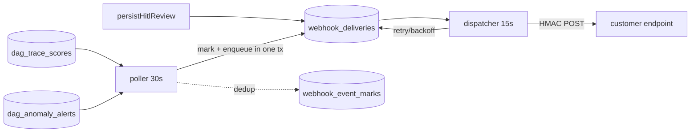

The public REST API and webhook delivery live entirely inside [dag-backend](https://github.com/hilt-ai/dag-backend) — they are HTTP routes plus one background worker in the same process that serves the dashboard, reading the same ClickHouse/Postgres that deployment is wired to. There is no separate API service and no multi-tenant broker: the platform is single-tenant per deployment, and request scope is the API key owner's team/host allow-list (`resolveUserScope`), identical to the dashboard. Customer-facing docs are the [API Reference](https://docs.hilt.ai/api/overview).

## Where things live

| Concern | Path (`dag-backend`) | Notes |
| --- | --- | --- |
| Bearer auth middleware | `apiv1_auth.go` | Resolves `hilt_live_*` → user → injected `SessionContext`; self-service key CRUD at `/api/me/api-keys` |
| Findings endpoints | `apiv1_handlers.go` | `GET /v1/findings`, `/findings/{id}`, `POST /findings/{id}/review` |
| Events/hosts/rules | `apiv1_read_handlers.go` | `GET /v1/events`, `/hosts`, `/detection-rules` |
| Webhook engine | `webhooks.go` | ClickHouse poller, outbox dispatcher, HMAC signing |
| Webhook management | `webhooks_handlers.go` | `/api/webhooks` CRUD + delivery log |
| Storage + migrations | `authdb.go` | Postgres `api_keys`, `webhook_subscriptions`, `webhook_deliveries`, `webhook_event_marks` |

Keys are SHA-256-hashed with a stored 16-char display prefix; secrets are never persisted in plaintext. The findings/events/hosts handlers reuse the dashboard's own query paths (`queryAnomalyFindingsWindow`, the events query builder, `dag_host_last_seen`), so the `/v1` surface returns the same data the UI does — it is not a parallel read path.

## Auth and scoping

`apiv1AuthMiddleware` is the only authenticator for `/v1/*`; `authMiddleware` lets the prefix through untouched. A valid key resolves to its owning user, and the middleware injects the same `SessionContext` cookie auth builds — so `ScopeHostsSQL` / `RequireHostsAccess` apply unchanged. Write scope (`write_scope` column) gates only `POST /v1/findings/{id}/review`. Revoked or expired keys are rejected on the next request (the lookup filters `revoked_at IS NULL AND (expires_at IS NULL OR expires_at > now())`).

## Webhook delivery

Findings and rule fires are written out-of-process (by [dag-detectionML](https://github.com/hilt-ai/dag-detectionML) and [dag-enrichment](https://github.com/hilt-ai/dag-enrichment)), so `finding.created` and `detection_rule.matched` are discovered by a ClickHouse **poller**, not an inline hook. `finding.reviewed` is enqueued directly from `persistHitlReview`, covering both the dashboard `PUT /api/hitl-review` and `POST /v1/findings/{id}/review` paths.

Mechanics that matter:

- **Exactly-once enqueue.** The dedup mark and the outbox rows commit in one transaction (`MarkAndEnqueueWebhookEvent`), so a crash can't consume a mark without its deliveries. On first boot the poller seeds marks over the lookback window without emitting, so a newly registered webhook never receives the historical backlog.
- **Poll window.** 7-day lookback (matches the fusion narrative worker) keyed on `wall_time_ns`, 30s freshness gate; rows whose wall time is older than 7 days at insert never emit. Suppression-window findings are excluded at discovery time to match dashboard visibility.
- **Dispatch is replica-safe.** Due rows are claimed under a 90s lease with `FOR UPDATE SKIP LOCKED`, so overlapping replicas or a rolling update don't double-send. Retries back off 1m → 5m → 30m → 2h, then `failed` after 5 attempts; every attempt's outcome is the customer-visible delivery log.
- **Signature.** `X-Hilt-Signature: sha256=HMAC-SHA256(secret, "<X-Hilt-Timestamp>.<body>")`. The timestamp binding is the replay guard; the delivery client refuses redirects so a registered URL can't bounce a signed POST to an internal target.

## Local development

Both workers are `READ_ONLY`-gated and need Postgres; the poller additionally needs ClickHouse (the dispatcher runs without it, since `finding.reviewed` doesn't require CH). Run the backend against a local ClickHouse + Postgres with `CLICKHOUSE_HOST` / `AUTH_DATABASE_URL` set, seed `dag_trace_scores` / `dag_anomaly_alerts` rows with a recent `wall_time_ns`, register a webhook, and watch the delivery log. See the worker registry entries `webhook_poller` / `webhook_dispatcher` on the Backend Process status card for liveness.
